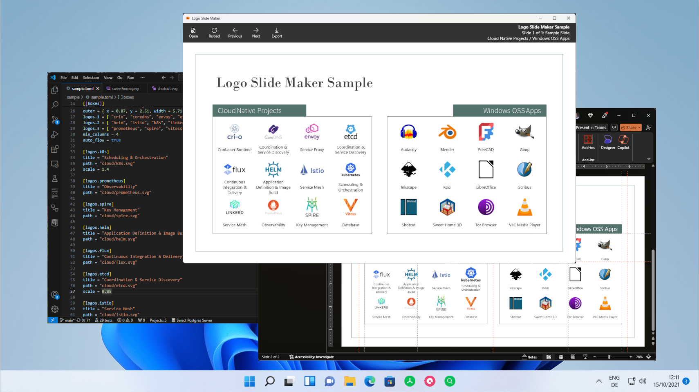

# Logo Slide Maker

Do you need a PowerPoint slide containing a gallery of logos? Perhaps you need to brag how many
other projects consume your technology? Or show off how many projects you're compatible with?
Or how many disparate technology components you've leverage in your own solution?

Logo Slide Maker is a Windows Desktop application to build, preview, and generate PowerPoint presentations containing
logos with text. It can also be run from a terminal window. 

## Getting started

Get the [latest version from the Microsoft Store](https://apps.microsoft.com/detail/9p09gnvhnl72). Then follow these simple steps to get started:

1. Create a TOML file describing your logos. Feel free to start with the [sample](./sample/sample.toml)!
1. Open the TOML file in the app to preview.
1. Make changes to the TOML as needed to fulfil your vision, and reload to update the preview with your changes.
1. If you have multiple slides defined, view each slide individually, using Previous and Next commands.
1. Once you're happy, export the slides to a PowerPoint presentation.

## Roadmap

For details on future planned features, please visit the [Issues](https://github.com/jcoliz/LogoSlideMaker/issues) section. Feel free to file an issue there to report a
bug or suggest a new feature.

## Other versions

The [Releases](https://github.com/jcoliz/LogoSlideMaker/releases) contains an archive of past releases.
Also new releases will be available here for a few days before they show up in the store, as it takes
a few days for the app to pass through the store certification. Download the latest MSIX for your architecture. 

If you're downloading a release directly, you'll need to download the matching security certificate (.cer). Install it in the "Local Machine" location, in the "Trusted Root Certificate Authorities" store. This step is
not needed if you're installing from the store (recommended).
